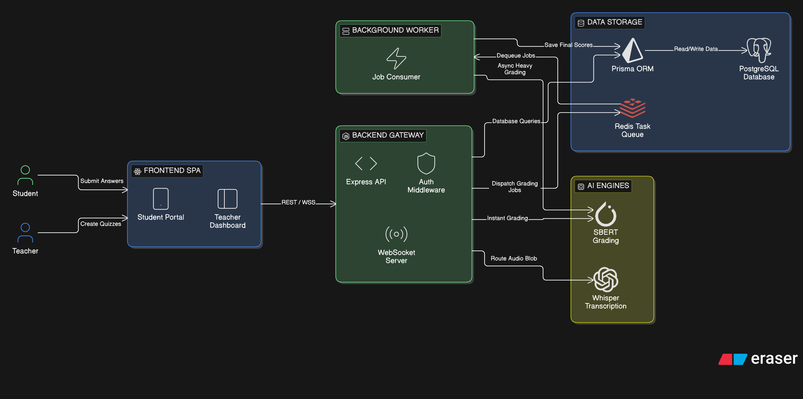
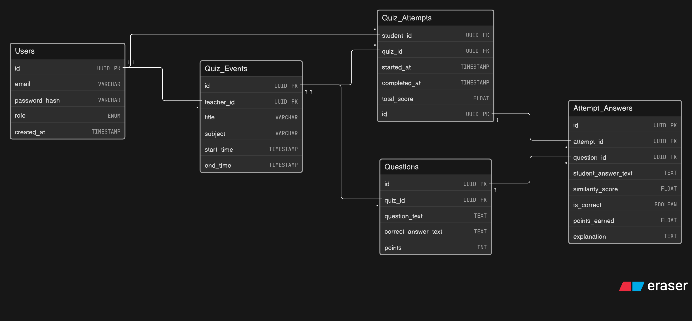
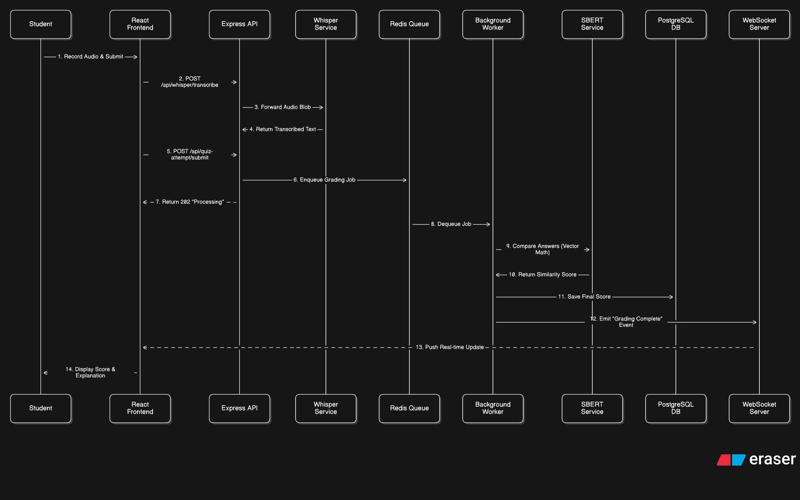

<div align="center">

#  **Speechify**
[](https://fastapi.tiangolo.com/)
[](https://react.dev/)
[](https://expressjs.com/)
[](https://www.postgresql.org/)
[](https://www.python.org/)
[](https://www.docker.com/)
[](https://redis.io/)
[](https://socket.io/)

**AI-powered semantic quiz grading platform for teachers and students.**

[Live Demo](https://speechify-psi.vercel.app) · [Report a Bug](https://github.com/shreedharkb/Speechify/issues) · [Request a Feature](https://github.com/shreedharkb/Speechify/issues)

</div>

---

## Overview

Speechify is a full-stack academic platform that replaces conventional exact-match grading with **AI-driven semantic evaluation**. Teachers create scheduled quizzes; students respond via text or voice. Answers are processed through a multi-layer NLP pipeline — combining lexical overlap, numeric detection, gibberish filtering, and context-aware cosine similarity using **Sentence-BERT (`all-MiniLM-L6-v2`)** — to return a meaningful grade and explanation in real time.

Voice answers are transcribed using **OpenAI Whisper**, and all computationally expensive grading tasks are offloaded to a **Bull/Redis job queue**, keeping the Node.js API non-blocking. Results are pushed back to the client via **Socket.IO WebSockets**.

---

## Table of Contents

- [Features](#features)
- [System Architecture](#system-architecture)
- [Tech Stack](#tech-stack)
- [Database Schema](#database-schema)
- [Workflows](#workflows)
- [Project Structure](#project-structure)
- [Quick Start](#quick-start)
- [Environment Variables](#environment-variables)
- [API Reference](#api-reference)
- [Deployment](#deployment)
- [CI/CD Pipeline](#cicd-pipeline)
- [License](#license)

---

## Features

| Feature | Description |
|---|---|
| **Semantic Grading** | Multi-layer NLP pipeline: gibberish detection → numeric grading → exact match → SBERT cosine similarity (60% direct + 40% context-aware) |
| **Voice Transcription** | Students record audio answers transcribed in real time using OpenAI Whisper (FastAPI microservice) |
| **Real-time Results** | Grading results pushed to the browser instantly via Socket.IO — no polling required |
| **Async Job Queue** | Bull queues backed by Redis ensure the Node.js API thread is never blocked by ML workloads |
| **Role-Based Access** | Separate Teacher and Student portals, secured with JWT + RBAC middleware |
| **Google OAuth** | One-click login and signup via Google OAuth 2.0 for both roles |
| **Scheduled Quizzes** | Teachers define `startTime` and `endTime`; the platform auto-activates and deactivates quizzes |
| **Rate Limiting** | 100 requests per minute per IP enforced globally on `/api/*` |

---

## System Architecture

The platform follows a **microservices architecture** with three independently deployable backend services and a React SPA frontend.

<div align="center">
  
</div>

### Component Overview

| Component | Technology | Port | Responsibility |
|---|---|---|---|
| **Frontend** | React 19 + Vite | `5173` | SPA — Teacher & Student UIs |
| **API Gateway** | Node.js + Express | `3001` | Auth, routing, RBAC, Socket.IO, job enqueue |
| **SBERT Service** | Python + Flask | `5002` | Semantic similarity grading (`all-MiniLM-L6-v2`) |
| **Whisper Service** | Python + FastAPI | `5000` | Speech-to-text transcription |
| **Database** | PostgreSQL 16 + Prisma ORM | `5432` | Relational data (users, quizzes, submissions, evaluations) |
| **Job Queue / Cache** | Redis 7 + Bull | `6379` | Async grading queue, result caching |

### Request Flow

```
Browser → React SPA
             │
             ▼ REST / WebSocket
     Node.js API (Express)
        │           │
        │           ▼ Bull Queue → Redis
        │        Grading Worker
        │                │
        ▼                ▼ HTTP
  PostgreSQL      SBERT Service (:5002)
  (Prisma ORM)         │
                        ▼
                  Result → Socket.IO → Browser
```

---

## Tech Stack

| Layer | Technology | Version | Notes |
|---|---|---|---|
| **Frontend** | React, Vite, Axios, Tailwind CSS | React 19, Vite 6 | SPA with role-based routing |
| **API Server** | Node.js, Express.js | Node 18+, Express 4 | REST + WebSocket gateway |
| **Auth** | JWT, bcryptjs, Google OAuth 2.0 | — | Role-based (Teacher / Student) |
| **Job Queue** | Bull, ioredis | Bull 4, Redis 7 | Async background grading |
| **Real-time** | Socket.IO | v4 | Grading result push to client |
| **Semantic AI** | Sentence-BERT (`all-MiniLM-L6-v2`) | PyTorch | Flask microservice on port 5002 |
| **Speech-to-Text** | OpenAI Whisper | FastAPI | Microservice on port 5000 |
| **Database** | PostgreSQL 16, Prisma ORM | Prisma 7 | 5-table relational schema |
| **DevOps** | Docker, Docker Compose | — | Full containerized local environment |
| **CI/CD** | Jenkins, SonarQube, OWASP DC, Trivy | — | Static analysis + image build + push |
| **Cloud Deploy** | Render (backend), Vercel (frontend) | — | Free-tier compatible |

---

## Database Schema

The database uses **PostgreSQL 16** managed through **Prisma ORM**. The schema consists of five tables with relational integrity enforced via foreign keys and cascade deletes.

<div align="center">
  
</div>

### Tables

| Table | Description |
|---|---|
| `students` | Student identity — name, email, roll number, year, branch, semester |
| `teachers` | Teacher identity — name, email, branch |
| `quizzes` | Quiz metadata + all questions as a `JSON` column + `correctAnswers` as `JSON` |
| `student_submissions` | One row per student–question pair; stores audio path and transcribed text |
| `submission_evaluations` | One row per student–quiz pair; stores `questionResults` JSON, total marks, total similarity |

> **Design Decision:** Questions are stored as a `JSON` array inside the `quizzes` table (not a separate relation) to allow flexible question structures (text, points, optional image URL) without schema migrations.

---

## Workflows

### Voice Submission & Grading

Illustrates the asynchronous flow from voice capture to final grade delivery via WebSocket.

<div align="center">
  
</div>

### Teacher's Journey

The decision tree from login to publishing an active, scheduled quiz.

<div align="center">
  
</div>

---

## Project Structure

```
Speechify/
├── Frontend/                   # React 19 SPA (Vite)
│   ├── src/
│   │   ├── components/         # Shared UI components
│   │   ├── pages/              # Route-level page components
│   │   │   ├── TeacherDashboard.jsx
│   │   │   ├── StudentDashboard.jsx
│   │   │   ├── QuizPage.jsx
│   │   │   └── ...
│   │   ├── utils/              # Axios instances, helpers
│   │   └── styles.css          # Global styles
│   ├── index.html
│   └── vite.config.js
│
├── Backend/                    # Node.js + Express API
│   ├── server.js               # Entry point — Express, Socket.IO, Worker init
│   ├── config/
│   │   ├── db.js               # PostgreSQL pool (pg)
│   │   └── redis.js            # ioredis client
│   ├── controllers/            # Business logic per domain
│   │   ├── authController.js   # Signup, login, Google OAuth, JWT issue
│   │   ├── quizController.js   # CRUD for quizzes + scheduling
│   │   ├── quizAttemptController.js  # Student answer submission
│   │   ├── gradeController.js  # SBERT HTTP call + warmup
│   │   ├── whisperController.js      # Whisper HTTP call + file upload
│   │   └── questionController.js
│   ├── routes/                 # Express routers
│   │   ├── auth.js             # /api/auth/*
│   │   ├── quiz.js             # /api/quiz/*
│   │   ├── quizAttempt.js      # /api/quiz-attempt/*
│   │   ├── whisper.js          # /api/whisper/*
│   │   └── questions.js        # /api/questions/*
│   ├── middleware/
│   │   └── rateLimitMiddleware.js    # 100 req/min per IP
│   ├── utils/
│   │   ├── queue.js            # Bull queue definitions
│   │   └── gradingWorker.js    # Background worker — dequeues & grades
│   ├── prisma/
│   │   └── schema.prisma       # Prisma data model (5 tables)
│   ├── Dockerfile              # Production container for Backend
│   └── package.json
│
├── sbert-service/              # Python Flask — Semantic Grading
│   ├── app.py                  # 6-layer grading pipeline + /grade + /batch-grade
│   ├── requirements.txt        # sentence-transformers, torch, flask
│   └── Dockerfile
│
├── whisper-service/            # Python FastAPI — Speech-to-Text
│   ├── app.py                  # /transcribe endpoint (Whisper model)
│   ├── requirements.txt
│   └── Dockerfile
│
├── assets/                     # Architecture and workflow diagrams
├── docker-compose.yml          # Local orchestration (Postgres, Redis, SBERT, Whisper)
├── Jenkinsfile                 # Jenkins CI/CD pipeline definition
├── render.yaml                 # Render cloud deployment manifest
└── README.md
```

---

## Quick Start

### Prerequisites

| Requirement | Version |
|---|---|
| Node.js | 18+ |
| Docker & Docker Compose | Latest |
| Python | 3.9+ *(only if running AI services bare-metal)* |

### 1. Clone the Repository

```bash
git clone https://github.com/shreedharkb/Speechify.git
cd Speechify
```

### 2. Start Infrastructure Services (Docker)

This starts PostgreSQL, Redis, the SBERT grading service, and the Whisper transcription service.

```bash
docker-compose up -d
```

### 3. Configure Environment Variables

```bash
cp Backend/.env.example Backend/.env
# Edit Backend/.env with your values (see Environment Variables section)
```

### 4. Start the Backend

```bash
cd Backend
npm install
npx prisma migrate dev   # Runs migrations and generates Prisma client
npm run dev              # Starts server on http://localhost:3001
```

### 5. Start the Frontend

```bash
cd Frontend
npm install
npm run dev              # Starts Vite dev server on http://localhost:5173
```

The application is now accessible at **[https://speechify-psi.vercel.app](https://speechify-psi.vercel.app)**.

---

## Environment Variables

### Backend (`Backend/.env`)

| Variable | Required | Default | Description |
|---|---|---|---|
| `PORT` | No | `3001` | Express server port |
| `NODE_ENV` | No | `development` | Environment mode |
| `JWT_SECRET` | **Yes** | — | Secret key for signing JWTs |
| `JWT_EXPIRES_IN` | No | `24h` | JWT expiry duration |
| `DB_HOST` | **Yes** | — | PostgreSQL host |
| `DB_PORT` | No | `5432` | PostgreSQL port |
| `DB_USER` | **Yes** | — | PostgreSQL username |
| `DB_PASSWORD` | **Yes** | — | PostgreSQL password |
| `DB_NAME` | **Yes** | — | PostgreSQL database name |
| `DATABASE_URL` | **Yes (prod)** | — | Full Prisma connection string for production |
| `REDIS_URL` | **Yes (prod)** | — | Redis connection URL (e.g., Upstash) |
| `SBERT_SERVICE_URL` | No | `http://localhost:5002` | URL of the SBERT grading microservice |
| `WHISPER_SERVICE_URL` | No | `http://localhost:5000` | URL of the Whisper transcription microservice |
| `FRONTEND_URL` | No | — | Allowed CORS origin for the frontend |
| `GOOGLE_CLIENT_ID` | No | — | Google OAuth 2.0 Client ID (backend verification) |

### Frontend (`Frontend/.env`)

| Variable | Required | Description |
|---|---|---|
| `VITE_API_URL` | **Yes** | Backend API base URL (e.g., `http://localhost:3001`) |
| `VITE_GOOGLE_CLIENT_ID` | No | Google OAuth 2.0 Client ID (frontend login button) |

---

## API Reference

### Authentication

| Method | Endpoint | Auth | Description |
|---|---|---|---|
| `POST` | `/api/auth/signup` | ❌ | Register a new Teacher or Student account |
| `POST` | `/api/auth/login` | ❌ | Login and receive a signed JWT |
| `POST` | `/api/auth/google` | ❌ | Google OAuth login / signup |

### Quizzes

| Method | Endpoint | Auth | Description |
|---|---|---|---|
| `POST` | `/api/quiz` | 👨‍🏫 Teacher | Create a new quiz with questions and scheduled time |
| `GET` | `/api/quiz` | 👨‍🏫 Teacher | Retrieve all quizzes created by the authenticated teacher |
| `GET` | `/api/quiz/active/student` | 👩‍🎓 Student | Get all currently active (time-windowed) quizzes |
| `GET` | `/api/quiz/:id` | ✅ Both | Get a specific quiz by ID |

### Quiz Attempts

| Method | Endpoint | Auth | Description |
|---|---|---|---|
| `POST` | `/api/quiz-attempt/submit` | 👩‍🎓 Student | Submit text/transcribed answers — enqueues async grading job |
| `GET` | `/api/quiz-attempt/results/:quizId` | 👩‍🎓 Student | Retrieve grading results for a completed attempt |

### Voice Transcription

| Method | Endpoint | Auth | Description |
|---|---|---|---|
| `POST` | `/api/whisper/transcribe` | ✅ Yes | Upload audio file; returns transcribed text from Whisper |

### System

| Method | Endpoint | Auth | Description |
|---|---|---|---|
| `GET` | `/api/health` | ❌ | Health check — DB, Redis, and queue status |
| `GET` | `/api/queue-stats` | ❌ | Current Bull queue metrics |

### SBERT Microservice (Internal)

| Method | Endpoint | Description |
|---|---|---|
| `GET` | `/health` | Service health + loaded model name |
| `POST` | `/grade` | Grade a single answer `{ questionText, studentAnswer, correctAnswer, threshold? }` |
| `POST` | `/batch-grade` | Grade multiple answers in one request |

---

## Deployment

### Local (Docker Compose)

```bash
# Start all services
docker-compose up -d --build

# View logs for the SBERT grading service
docker-compose logs -f sbert-service

# View logs for the Whisper service
docker-compose logs -f whisper-service

# Stop all services
docker-compose down
```

### Cloud (Render + Vercel)

The `render.yaml` file in the repository root defines all Render services:

| Service | Type | Plan |
|---|---|---|
| `speechify-sbert` | Docker web service | Free |
| `speechify-whisper` | Docker web service | Free |
| `speechify-api` | Node.js web service | Free |
| `speechify-db` | Managed PostgreSQL | Free |

**Steps:**

1. Push the repository to GitHub.
2. In Render, create a new **Blueprint** and point it to the repository — Render will auto-detect `render.yaml`.
3. Set any `sync: false` environment variables (e.g., `REDIS_URL`, `FRONTEND_URL`) manually in the Render dashboard.
4. Deploy the Frontend to **Vercel** by importing the `Frontend/` directory and setting `VITE_API_URL` to the Render backend URL.

---

## CI/CD Pipeline

The `Jenkinsfile` defines a 6-stage automated pipeline:

```
Git Checkout
     │
     ▼
Install Dependencies  (npm install for Backend & Frontend)
     │
     ▼
SonarQube Analysis    (static code quality + vulnerability scan)
     │
     ▼
OWASP Dependency Check  (CVE scan on all npm packages)
     │
     ▼
Trivy Filesystem Scan  (container vulnerability scan)
     │
     ▼
Docker Build          (builds Backend image: shreedharkb/speechify:latest)
     │
     ▼
Docker Push to DockerHub
```

**Post-build:** Dependency check report is published and Docker is logged out automatically.

---

## Author

**Shreedhar K B**
[GitHub](https://github.com/shreedharkb) · [Live Demo](https://speechify-psi.vercel.app)

---

## License

This project is licensed under the [MIT License](LICENSE).
