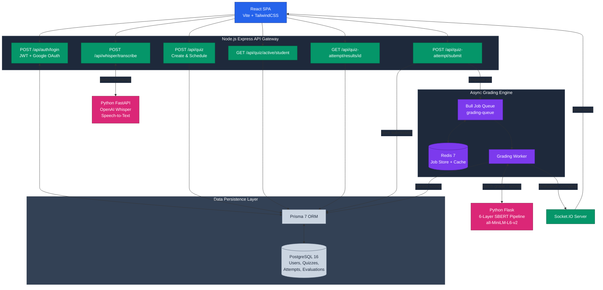
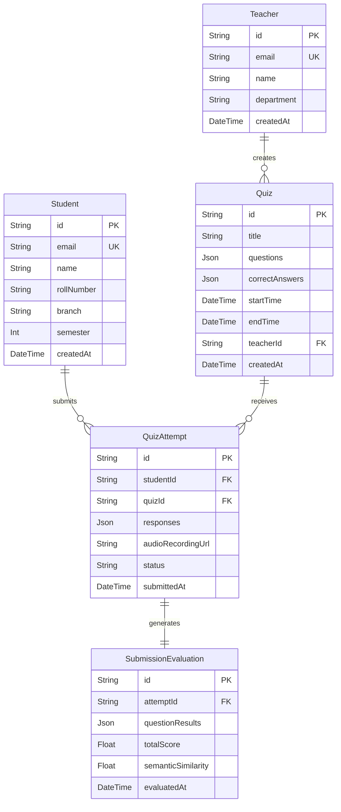
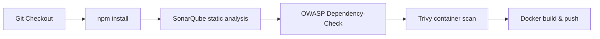

# Speechify

**Live:** [speechify-psi.vercel.app](https://speechify-psi.vercel.app) · API: [speechify-api.onrender.com](https://speechify-api.onrender.com)

AI-powered semantic quiz grading and voice assessment platform. Teachers schedule quizzes; students respond by voice or typed text. Answers are graded through a multi-layer NLP pipeline — gibberish detection, numeric validation, keyword overlap, and Sentence-BERT cosine similarity — for instant, explainable scores. Voice submissions are transcribed in real time via OpenAI Whisper, heavy grading runs asynchronously on Bull/Redis workers, and results are pushed back live over Socket.IO.

## Table of Contents

- [Features](#features)
- [Architecture](#architecture)
- [Database Schema](#database-schema)
- [Tech Stack](#tech-stack)
- [Project Structure](#project-structure)
- [Quick Start](#quick-start)
- [Environment Variables](#environment-variables)
- [API Reference](#api-reference)
- [Deployment](#deployment)
- [CI/CD Pipeline](#cicd-pipeline)

## Features

**Semantic NLP Grading**
Every student answer passes through a 6-layer grading pipeline built on PyTorch and `sentence-transformers`: gibberish filtering, stopword stripping, numeric constant validation, exact keyword overlap (60% weight), and Sentence-BERT cosine similarity on `all-MiniLM-L6-v2` embeddings (40% weight). Synonyms and rephrased answers are scored correctly instead of being rejected for not matching an exact string.

**Real-Time Voice Assessment**
Students can answer by speaking directly into the browser. Audio is streamed as multipart form-data to a dedicated Python FastAPI microservice running OpenAI Whisper, which returns a transcription that feeds straight into the grading pipeline.

**Async Bull/Redis Grading Queue**
Submissions are never graded synchronously. The Express API Gateway enqueues a `{attemptId, answers}` job and returns `202 Accepted` immediately. A background Node.js worker dequeues the job, calls the SBERT microservice, and persists the evaluated scores — keeping the event loop free under concurrent exam load.

**Instant WebSocket Score Broadcast**
Once grading finishes, the worker emits `evaluation_complete` over Socket.IO directly to the student's session, delivering `{score, feedback, questionResults}` with no polling required.

**Role-Based Access Control**
Isolated Teacher and Student portals secured by JWT middleware and Google OAuth 2.0 SSO. Every route is authorized at the middleware layer before any controller logic runs.

**Automated Quiz Scheduling**
Teachers define a `startTime`/`endTime` window per quiz. Quizzes automatically activate and close — students only see a quiz while it's inside its valid window.

## Architecture

Speechify employs a microservices architecture decoupling client presentation, REST routing, async queue scheduling, speech transcription, and transformer inference into independent, individually deployable services. See [API Reference](#api-reference) for the full endpoint list behind the gateway.



Infrastructure layers:

- **React 19 + Vite** renders the Teacher and Student dashboards, deployed on Vercel.
- **Express Gateway** handles HTTP, JWT/OAuth auth, rate limiting, and Socket.IO streaming.
- **Bull + Redis** decouples grading from the request/response cycle for async evaluation.
- **Python FastAPI (Whisper)** transcribes voice answers into text.
- **Python Flask (SBERT)** runs the 6-layer semantic grading pipeline.
- **PostgreSQL + Prisma** stores users, quizzes, attempts, and evaluation results.
- **Render.com** hosts the gateway, both AI microservices, and the managed database; internal services communicate over Render's private network.

## Database Schema

A 5-table normalized schema in PostgreSQL 16, managed through Prisma. `questions` and `correctAnswers` use `JSONB` columns so quiz structure can vary without schema migrations, and `questionResults` stores a per-question breakdown with cosine similarity percentages.



## Tech Stack

| Component | Technology |
|---|---|
| Frontend | React 19, Vite, TailwindCSS, Axios |
| API Gateway | Node.js, Express 4 |
| Real-Time Engine | Socket.IO v4 |
| Async Queue | Bull 4, Redis 7 |
| Semantic Grading Service | Python, Flask, PyTorch, sentence-transformers (`all-MiniLM-L6-v2`) |
| Speech-to-Text Service | Python, FastAPI, OpenAI Whisper |
| Database | PostgreSQL 16, Prisma 7 ORM |
| Auth | JWT, Google OAuth 2.0 |
| CI/CD | Jenkins, SonarQube, OWASP Dependency-Check, Trivy |
| Deployment | Vercel (frontend), Render.com (backend, microservices, managed Postgres) |

## Project Structure

```
Speechify/
├── Frontend/                 # React 19 SPA built with Vite
│   ├── src/
│   │   ├── components/       # Reusable UI widgets and navigation cards
│   │   ├── pages/            # Role views (TeacherDashboard, StudentDashboard, QuizPage)
│   │   └── utils/            # Axios interceptors and WebSocket listeners
│   └── public/                # Static assets and favicon
├── Backend/                  # Node.js + Express API Gateway
│   ├── controllers/          # Auth, quizzes, submissions, voice handling
│   ├── middleware/            # JWT verification, RBAC guards, rate limiters
│   ├── prisma/                # Prisma schema and migrations
│   ├── routes/                # /api/auth, /api/quiz, /api/whisper endpoints
│   └── utils/                 # Bull queue config and grading worker logic
├── sbert-service/             # Python Flask microservice — semantic evaluation
│   ├── app.py                 # 6-layer grading pipeline, /batch-grade endpoint
│   └── requirements.txt
├── whisper-service/           # Python FastAPI microservice — voice transcription
│   ├── app.py                 # /transcribe handler interfacing with OpenAI Whisper
│   └── requirements.txt
├── assets/                    # Architecture and schema diagrams
├── docker-compose.yml         # Local multi-container infrastructure
├── render.yaml                # Render.com deployment configuration
└── Jenkinsfile                # CI/CD build, test, and security scan pipeline
```

## Quick Start

### Prerequisites

- Node.js 18+
- Python 3.9+
- Docker and Docker Compose

### 1. Start infrastructure

```bash
git clone https://github.com/shreedharkb/Speechify.git
cd Speechify
docker-compose up -d --build
```

This brings up PostgreSQL, Redis, the SBERT service, and the Whisper service.

### 2. Backend

```bash
cd Backend
cp .env.example .env
# Edit .env — set DATABASE_URL, REDIS_URL, JWT_SECRET, etc.
npm install
npx prisma migrate dev
npm run dev
```

### 3. Frontend

```bash
cd ../Frontend
npm install
npm run dev
```

Open `http://localhost:5173`.

## Environment Variables

### Backend (`Backend/.env`)

| Variable | Description |
|---|---|
| `PORT` | Express server port (default: `3001`) |
| `JWT_SECRET` | Signing secret for auth tokens |
| `DATABASE_URL` | PostgreSQL connection string |
| `REDIS_URL` | Redis connection URL for queue and cache |
| `SBERT_SERVICE_URL` | SBERT microservice base URL |
| `WHISPER_SERVICE_URL` | Whisper microservice base URL |
| `FRONTEND_URL` | Allowed CORS origin |
| `GOOGLE_CLIENT_ID` | Google OAuth 2.0 client ID (optional) |
| `GOOGLE_CLIENT_SECRET` | Google OAuth 2.0 client secret (optional) |

### Frontend (`Frontend/.env`)

| Variable | Description |
|---|---|
| `VITE_API_URL` | Backend API base URL |
| `VITE_GOOGLE_CLIENT_ID` | Google OAuth 2.0 client ID (optional) |

## API Reference

| Method | Endpoint | Auth | Description |
|---|---|---|---|
| `POST` | `/api/auth/login` | Public | Authenticate and return a signed JWT + role |
| `POST` | `/api/auth/google` | Public | Google OAuth 2.0 callback, issues JWT for SSO |
| `POST` | `/api/quiz` | Teacher | Create a quiz with JSONB questions and a time window |
| `GET` | `/api/quiz/active/student` | Student | List quizzes active in the current time window |
| `GET` | `/api/quiz/:id` | Authenticated | Fetch a single quiz's questions |
| `POST` | `/api/quiz-attempt/submit` | Student | Submit answers and enqueue the grading job |
| `GET` | `/api/quiz-attempt/results/:id` | Authenticated | Fetch evaluated results for an attempt |
| `POST` | `/api/whisper/transcribe` | Authenticated | Stream audio for transcription |
| `GET` | `/api/health` | Public | Health check across DB, Redis, and AI services |

## Deployment

Speechify is live, deployed across two cloud platforms:

| Service | Platform | URL |
|---|---|---|
| Frontend (React SPA) | Vercel | [speechify-psi.vercel.app](https://speechify-psi.vercel.app) |
| Backend API (Express) | Render.com | [speechify-api.onrender.com](https://speechify-api.onrender.com) |
| SBERT Microservice | Render.com | Internal (Render private network) |
| Whisper Microservice | Render.com | Internal (Render private network) |
| PostgreSQL 16 | Render Managed DB | Internal (Render private network) |

`render.yaml` at the repo root declares all four Render.com services plus the managed PostgreSQL instance. Internal services (SBERT, Whisper) talk to the gateway over Render's private network only — neither is publicly exposed.

## CI/CD Pipeline

`Jenkinsfile` runs a 6-stage pipeline on every push: dependency audit, static analysis, container vulnerability scanning, and image build/push.



## Author

**Shreedhar K B** — Design, development, and deployment.

## License

This project is licensed under the MIT License — see [LICENSE](LICENSE) for details.